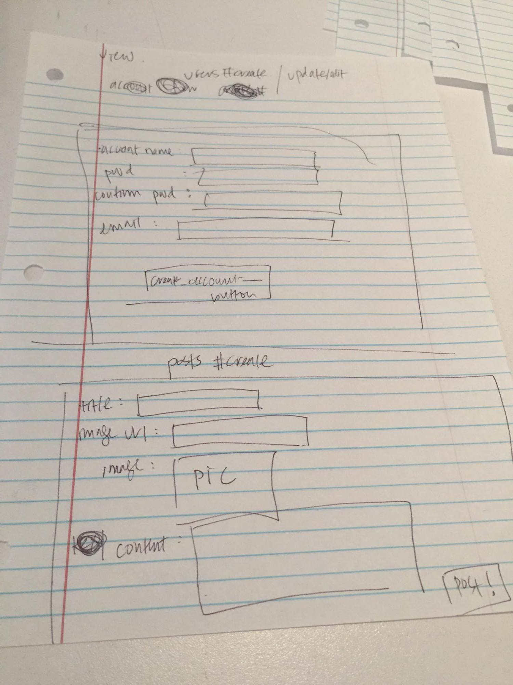
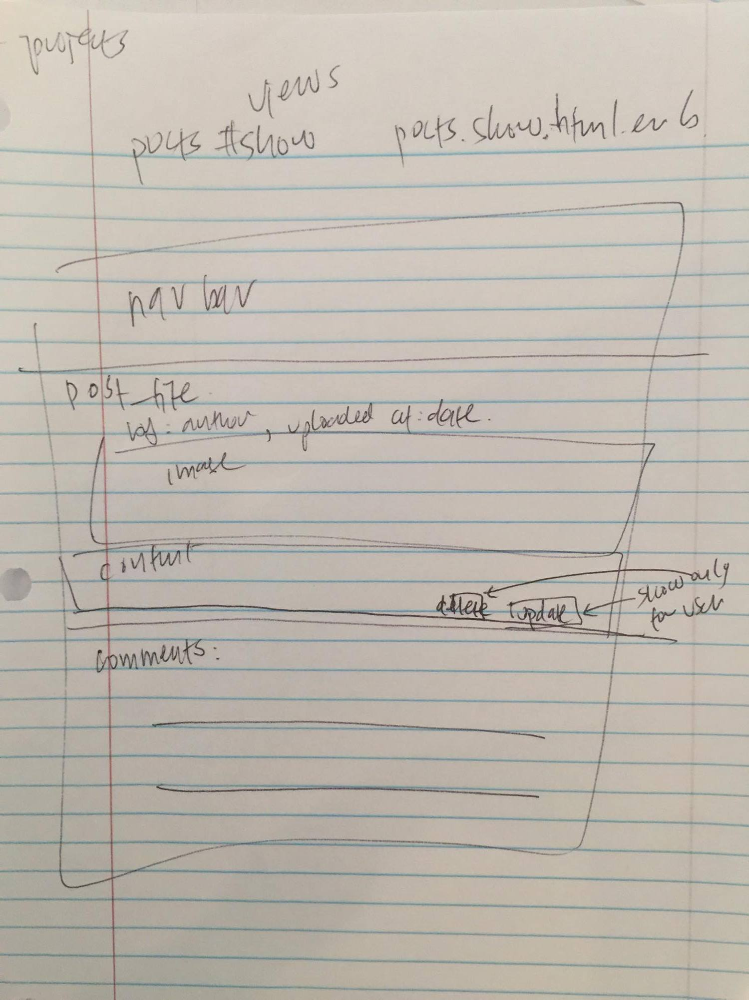
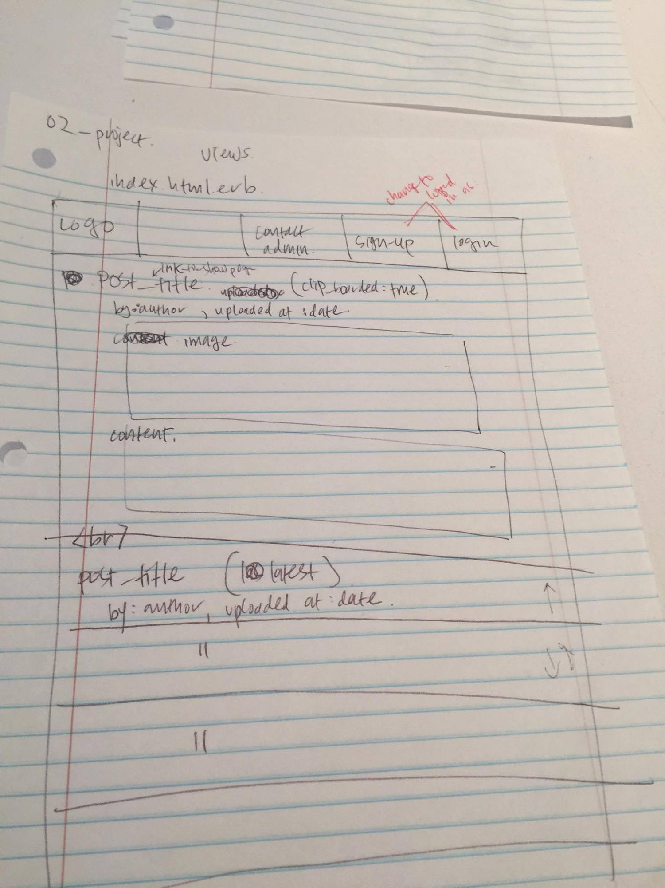
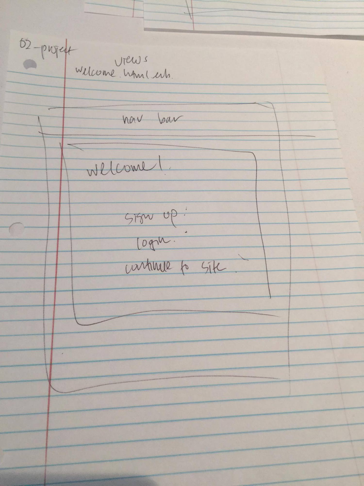
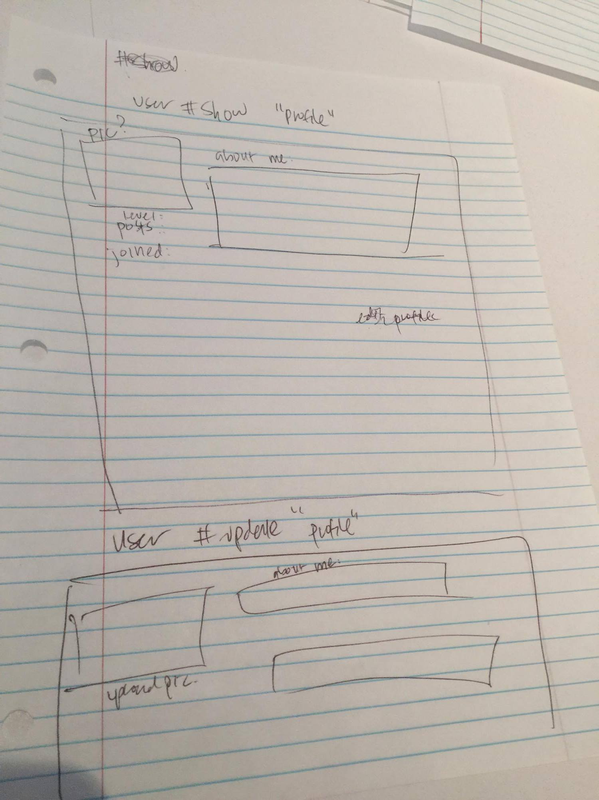
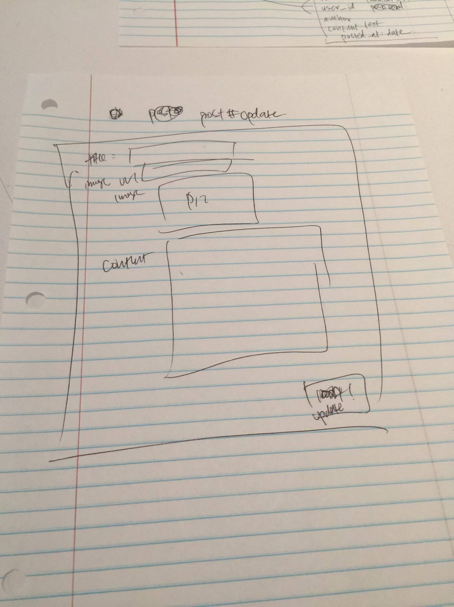

# README

Trello: https://trello.com/b/W4y5Pa9D/project-2-dota-blog

Github: https://github.com/johnlee94/wdi_project2_dota

Heroku: 	https://dota-project.herokuapp.com/

**Approach taken**:	

Set up my ERD initially (Users, Posts, Comments). Generated the models into the db and then built the relationships. Added features as I saw fit or needed (Authentication, Authorization, navbar, etc). Added bootstrap/bootswatch for styling purposes.

**Technologies used:** 

ruby 2.3.1, rails 5.1, js, css, html, postgresql, heroku, gems (bootstrap, bootswatch, bcrypt)

Installation Instructions:**

Clone the repo into your local workspace. Bundle install the necessary gems. Make sure you have a modern-enough rails and ruby versions as well. Then render app in preferred browser.

**ERD:**

**WireFrames!:**

.jpg)

