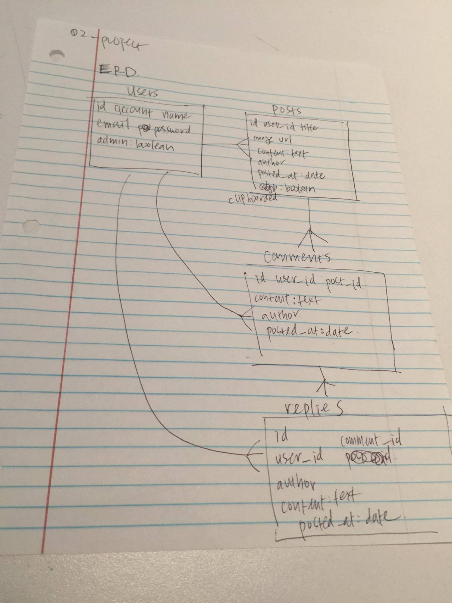

# README

Trello: https://trello.com/b/W4y5Pa9D/project-2-dota-blog

Github: https://github.com/johnlee94/wdi_project2_dota

Heroku: 	https://dota-project.herokuapp.com/

Approach taken:

Technologies used: ruby, rails, js, css, html, postgresql, heroku, gems

Installation Instructions:

WireFrames!:

.jpg)

